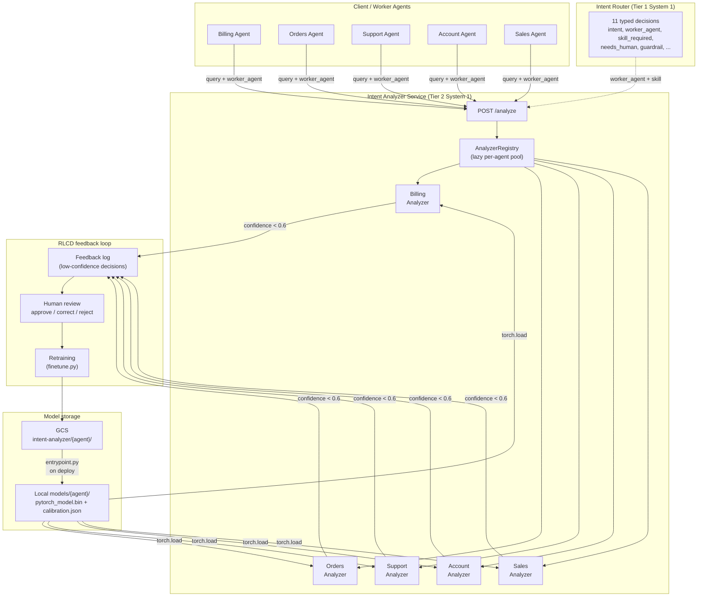
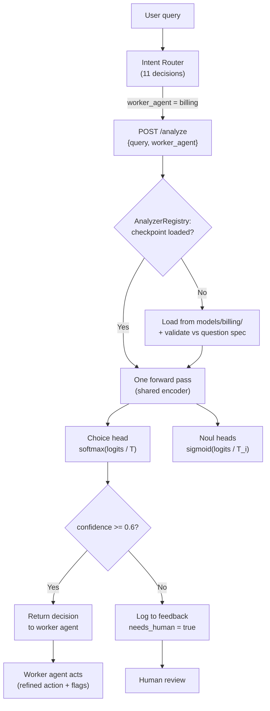
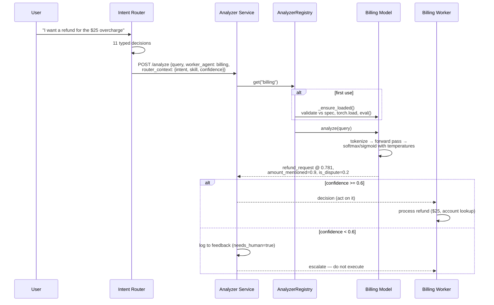
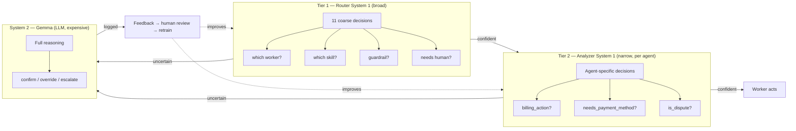
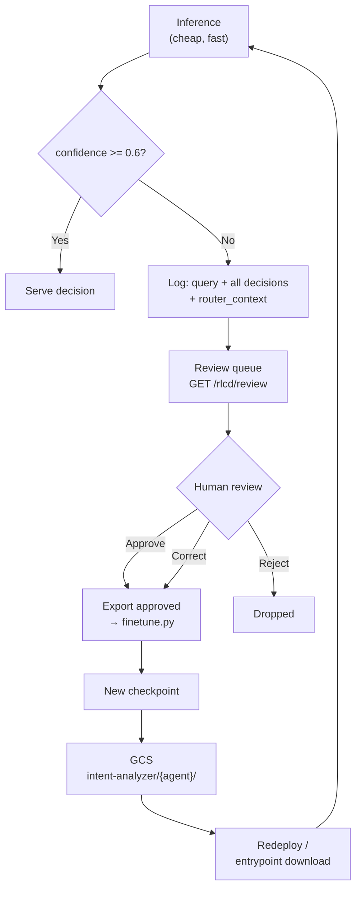
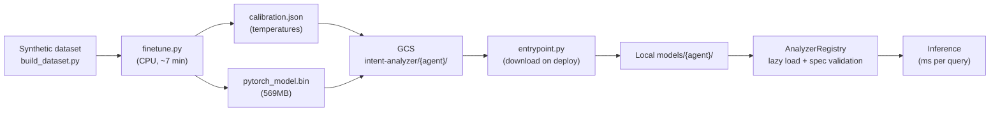

# Intent Analyzer — Software Design Review

**Status:** POC (2026-10-08)
**Companion:** intent-router-laya (the intent router; this repo is its
deeper second tier)

---

## 1. Problem statement

The intent router's System 1 answers 11 coarse routing decisions per
query: intent, worker_agent, skill_required, guardrail, and six Noul
flags. That is enough to *route* — it is not enough to *act*.

Each worker agent needs deeper, domain-specific answers before it can
execute. "Billing" is not an action: is the customer checking a balance,
paying now, disputing a charge, or asking for a refund? Does the request
need payment credentials? Was an amount mentioned? The router cannot
answer these without becoming a monolith that knows every domain's
taxonomy — which defeats the purpose of typed, narrow System 1 models.

## 2. Goals

- Give every worker agent its own fine-tuned **intent analyzer**: a
  second, narrower System 1 that answers agent-specific typed decisions.
- Keep the typed-decision (Choice / Noul / Score) pattern and the
  single-source-of-truth discipline from intent-router-laya.
- Keep everything CPU-trainable: narrow domain, small model, high
  accuracy, fast inference.
- Define the router → analyzer integration contract and the
  fallback/escalation policy.
- Reuse the RLCD feedback loop: log low-confidence analyzer decisions
  for human review, retrain on approved records.

## 3. Non-goals

- Replacing the router. The analyzer is tier 2; the router still owns
  intent, guardrail, and worker selection.
- A System 2 (LLM) reviewer inside the analyzer service. Low-confidence
  analyzer decisions escalate to a human or back to the router's System 2
  path — a second LLM per agent is cost without evidence.
- Cross-agent reasoning. One query → one analyzer. Multi-agent
  orchestration stays in the router/worker layer.

## 4. Design

### 4.1 Two-tier System 1

```
User query
  │
  ▼
Intent Router (System 1: 11 coarse decisions)
  intent, worker_agent, skill_required, guardrail, noul flags…
  │
  ▼  worker_agent + skill_required + query
Agent's Intent Analyzer (System 1: agent-specific decisions)
  billing_action / order_action / … + agent noul flags
  │
  ├── confident ──► refined action + flags ──► worker executes
  └── unsure ──► needs_human ──► escalate (human / router System 2)
```

The router decides *who* handles the query; the analyzer decides *what
exactly* the handler must do. Both tiers are fast local encoders; the
expensive LLM only appears on the escalation path.

### 4.2 Per-agent question sets

Single source of truth: `src/analyzer_questions.py` (mirrors the
router's `src/system1_questions.py`). Training (`train/build_dataset.py`,
`train/finetune.py`) and serving (`src/analyzers.py`) import it verbatim.

| Agent | Choice question (options) | Noul flags |
|---|---|---|
| billing | `billing_action`: check_balance, make_payment, dispute_charge, refund_request, update_payment_method, billing_info | needs_payment_method, is_dispute, amount_mentioned, is_recurring |
| orders | `order_action`: track, cancel, modify, return, reorder, order_info | has_order_id, is_urgent, needs_address |
| support | `support_topic`: technical_issue, how_to, account_access, complaint, feedback | needs_troubleshooting, is_escalation_worthy |
| account | `account_action`: update_info, delete_account, change_plan, security, verify_identity | is_irreversible, needs_identity_verification |
| sales | `sales_intent`: pricing, compare_plans, demo_request, trial, purchase | is_ready_to_buy, needs_human_sales |

### 4.3 Model: multi-task encoder

One ModernBERT-base encoder per agent (same family as the router's
`train/finetune.py` track), with one head per typed decision:

- **choice head** → cross-entropy over the agent's action taxonomy
- **noul heads** → one logit each, binary cross-entropy

Loss = CE(choice) + mean(BCE(noul)). After training, each head gets its
own fitted temperature on the held-out split (per-head calibration —
confidence numbers must mean what they say, because the escalation
threshold depends on them).

Why one model per agent instead of one model with 5 heads? Narrow domain
→ less label interference, independent retraining cadence per agent,
independent rollback. The cost is 5 small checkpoints, not 5 large ones.

### 4.4 Training data

`train/build_dataset.py` emits synthetic per-agent JSONL via
deterministic heuristics over hand-written seed examples (48–52 seeds
per agent), repeated with template paraphrasing. Labels are derived
from the **seed** (before paraphrasing) so template noise never changes
a label — the same discipline as the router's dataset builder.

Current corpus (`--repeat 6`): 1,332 records total
(billing 300, orders 312, support 240, account 240, sales 240), choice
classes perfectly balanced, every noul flag with positives.

### 4.5 Integration contract

The router calls the analyzer service after routing:

```
POST /analyze
{"query": "...", "worker_agent": "billing",
 "router_context": {"intent": "billing_inquiry",
                    "skill_required": "refund_process",
                    "confidence": 0.93}}
→
{"agent": "billing",
 "billing_action": "refund_request", "choice_confidence": 0.97,
 "needs_payment_method": 0.0, "is_dispute": 0.0,
 "amount_mentioned": 1.0, "is_recurring": 0.0,
 "needs_human": false, ...}
```

- `worker_agent` selects the analyzer; unknown agents → 400.
- `router_context` is echoed into the feedback log (provenance for
  retraining) but does not change the analyzer's decision.
- `needs_human=true` (choice confidence < 0.6) → the worker must
  escalate, not execute. The decision is logged for human review.

### 4.5b Model access per agent

A worker agent never touches model files directly — it calls the analyzer
service, which owns checkpoint lifecycle:

1. **Service API (normal path):** `POST /analyze {"query", "worker_agent"}`.
   The registry lazy-loads the agent's checkpoint on first use and
   validates it against `src/analyzer_questions.py` (choice labels, noul
   questions, agent name) before serving. A mismatched checkpoint is
   rejected, not silently served — the 2026-10-07 router lesson.
2. **GCS at deploy time:** `entrypoint.py` downloads each agent's
   checkpoint from `gs://laya-checkpoints-anuj/intent-analyzer/{agent}/`
   into `$ANALYZER_CHECKPOINT_DIR/{agent}/` on container startup (skips
   agents already present). Env: `ANALYZER_CHECKPOINT_GCS`,
   `ANALYZER_CHECKPOINT_DIR`, `ANALYZER_AGENTS`.
3. **Direct:** `gsutil -m cp -r gs://laya-checkpoints-anuj/intent-analyzer/billing ./models/billing`
   then `AnalyzerRegistry("models")` in Python or `ANALYZER_CHECKPOINT_DIR`
   for the service. Each agent dir holds `pytorch_model.bin`,
   `config.json`, `tokenizer.json`, `tokenizer_config.json`,
   `calibration.json` (~570MB/agent).

### 4.6 Fallback / escalation policy

| Signal | Action |
|---|---|
| choice confidence ≥ 0.6 | worker executes with the refined action + flags |
| choice confidence < 0.6 | `needs_human=true`; escalate to human or router System 2; log for review |
| account analyzer: `is_irreversible` ≥ 0.8 | force human confirmation regardless of confidence (destructive actions) |
| no checkpoint for the agent | 503; router falls back to its own coarse decisions |
| analyzer 5xx / timeout | router's coarse decisions stand; alert, don't block |

### 4.7 Feedback loop (RLCD, per agent)

`src/feedback.py` mirrors the router's `FeedbackLogger`: every
low-confidence analyzer decision appends to
`feedback/analyzer_fallbacks.jsonl` with query, decisions, and
router_context. Human review gate: pending → approved / corrected /
rejected. Only approved/corrected records feed the next
`train/finetune.py --agent <agent>` cycle. Track per-agent
low-confidence rate as the improvement KPI.

## 5. Alternatives considered

- **One giant analyzer for all agents:** rejected — label interference
  across domains, no independent rollback, retraining churn on every
  domain change.
- **LLM (System 2) instead of per-agent encoders:** rejected for the
  hot path — latency and cost per query; kept only as the escalation
  path via the router.
- **Router asks the deep questions itself (more than 11 decisions):**
  rejected — the router's question set would grow unboundedly with
  every new agent/skill; tiering keeps each model narrow and accurate.

## 6. Evaluation plan

- Per-agent: val choice accuracy, per-head noul accuracy, mean
  calibrated confidence (reported by `train/finetune.py`).
- Contract tests (`tests/test_contract.py`): dataset label keys ==
  spec question ids; choice option order stable train↔serve; serving
  rejects checkpoints whose labels mismatch the spec; OpenAPI covers
  every app route.
- Integration: `demo/router_to_analyzer.py` runs scripted router
  outputs through the real trained analyzers.
- Live: per-agent low-confidence rate trending down across retrain
  cycles (the RLCD KPI).

## 7. Rollout plan

1. Train billing analyzer (done — see §8), serve behind `/analyze`.
2. Router calls analyzer for billing-routed queries; shadow mode first
   (log analyzer decisions without acting on them), then live.
3. Train remaining 4 agents; same shadow→live per agent.
4. Independent retraining cadence per agent driven by its feedback log.

## 8. Training results (2026-10-08)

Per-agent fine-tunes on CPU (ModernBERT-base, 5 epochs, batch 8,
2 vCPUs). Each run: ~150 steps, ~7 min. Per-head temperature scaling
fitted on the held-out split.

| Agent | Records | Val choice acc | Val noul acc | Mean conf | Temp (choice) |
|---|---|---|---|---|---|
| billing | 300 | 0.950 | 0.954 | 0.925 | 0.975 |
| orders | 312 | 0.952 | 0.984 | 0.945 | 0.755 |
| support | 240 | 1.000 | 1.000 | 1.000 | 0.394 |
| account | 240 | 1.000 | 1.000 | 1.000 | 0.245 |
| sales | 240 | 0.958 | 0.990 | 0.978 | 0.289 |

**Calibration bug found & fixed (2026-10-08):** the first orders run
fitted a degenerate *negative* temperature (-6551) — LBFGS overshot
past 0 on a very confident model, collapsing predictions to uniform
(val accuracy 0.000). The raw weights were fine (4/4 spot-checks
correct). Fix: optimize in log-space (temperature always positive) +
sanity clamp to [0.05, 10] with fallback to 1.0. All agents retrained
with the fix; billing's original temperature (0.975) was sane and kept.

**Billing smoke test** (real checkpoint, `src/analyzers.py`):
- "I want a refund for the $25 overcharge" → `refund_request` @ 0.781,
  amount_mentioned=0.23, needs_human=false
- "Why was I charged twice this month" → `dispute_charge` @ 0.882,
  is_dispute=0.55, needs_human=false

Choice head is strong; noul flags are directionally correct but soft
(few positives per flag — e.g. amount_mentioned has 18). Honest
probabilities; more positives per flag is the known next data
improvement.

## 9. Open questions

- Should `router_context` (e.g. skill_required) become a model *input*
  (feature) rather than just log provenance? Currently no — keeps the
  analyzer independent of router versions.
- Multi-agent queries ("cancel my order and refund me") — currently
  one analyzer per query; router-side decomposition is future work.
- Score-type questions (like the router's guardrail) per agent —
  deferred until a domain needs graded risk, not just flags.

## 10. Diagrams

### 10.1 System architecture (components)



### 10.2 Request flow (flowchart)



### 10.3 Sequence diagram (full request)



### 10.4 System 1 vs System 2 (two-tier decisions)



### 10.5 RLCD feedback loop



### 10.6 Model lifecycle



### 10.7 Deployment topology

```mermaid
flowchart TB
    subgraph GCP["GCP — Innovation Lab"]
        subgraph GCSB["Cloud Storage"]
            RM["laya-checkpoints-anuj/\nintent-analyzer/{billing,orders,...}/"]
        end
        subgraph CR["Cloud Run"]
            Svc["intent-analyzer service\n(entrypoint.py → uvicorn)"]
        end
    end

    subgraph GH["GitHub"]
        Repo["intent-analyzer-laya\n(code, SDR, datasets)"]
    end

    subgraph Dev["Developer machine"]
        Tr["train/finetune.py"]
    end

    Dev -->|train| Tr
    Tr -->|upload serving files| RM
    GH -->|code (no binaries)| Svc
    RM -->|entrypoint download| Svc
    Svc -->|POST /analyze| Client["Worker agents"]
```
